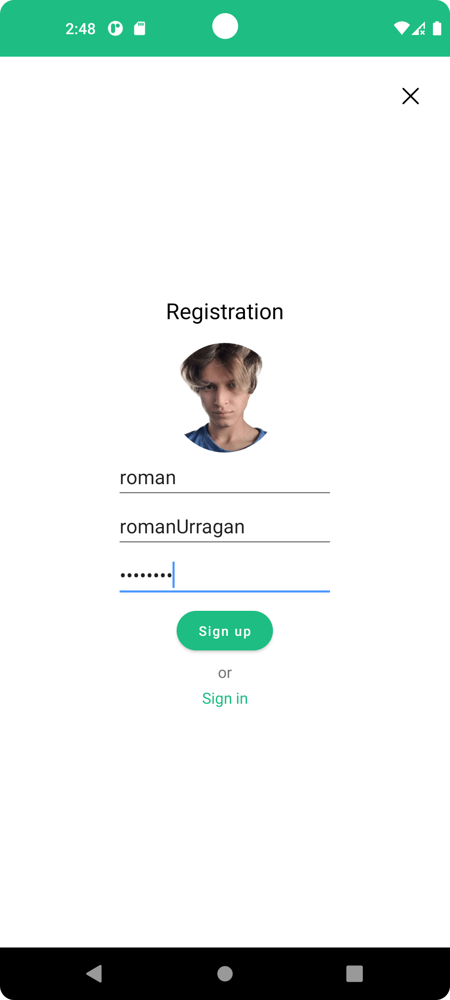
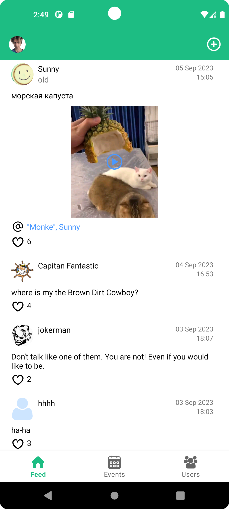
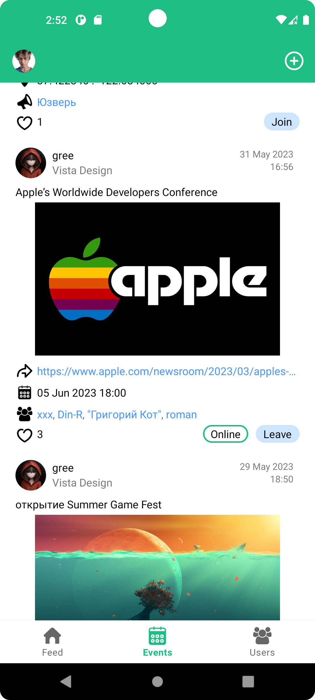
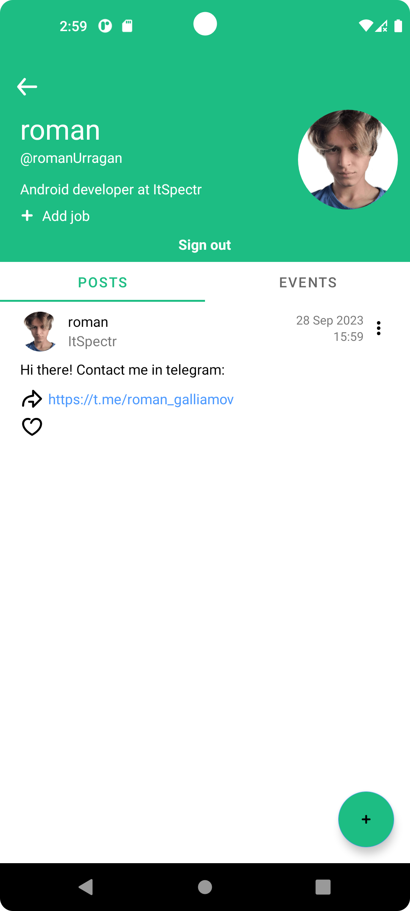
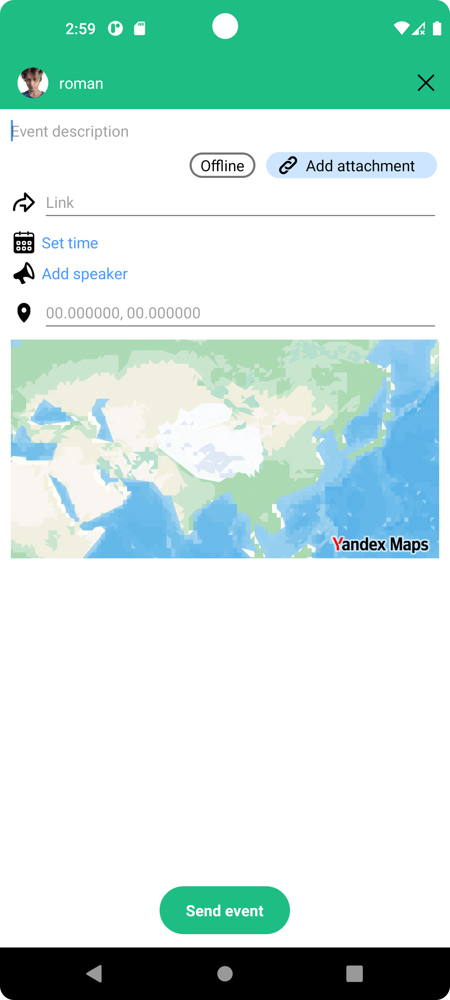
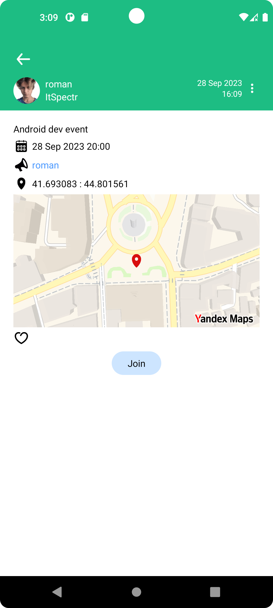

# Professional Social Network
**👥 A Social Platform for Professional Networking**

*Diploma Project - Android Development Practice*

## 🎓 Project Purpose
A comprehensive social networking application designed as a diploma project to demonstrate and practice advanced Android development skills. The platform enables professionals to share achievements, build connections, and exchange multimedia content.

## 🎯 Core Functionality
- **Professional achievement sharing** with rich media support
- **Social networking features** for building professional connections
- **Media content exchange** between users
- **Interactive post feed** with engagement capabilities
- **Event management** system with CRUD operations
- **User profile management** with comprehensive settings
- **Geolocation integration** for location-based features

## 👨‍💻 Development Scope & Responsibilities

### Full-Stack Implementation
- **Complete application development** from initial design concepts to production-ready features
- **UI/UX design and implementation** focusing on intuitive user interactions
- **Architecture design** ensuring scalable and maintainable codebase

### API Integration
- **External API integration** for user authentication and authorization
- **Data synchronization** for posts, events, and user profiles
- **Network layer implementation** using Retrofit and OkHttp3

### User Experience Optimization
- **Seamless post feed interaction** with smooth scrolling and loading
- **Interactive map integration** for location-based features
- **Media content handling** with optimized loading and caching

### Data Management
- **CRUD operations implementation** for posts, events, and user profiles
- **Local data storage** with offline capability
- **Data consistency** between local and remote sources

## 🛠 Technical Stack

### Architecture & Patterns
- **MVVM** - Model-View-ViewModel architecture pattern
- **Dagger Hilt** - Dependency injection framework

### Data & Networking
- **Room Database** - Local data persistence
- **Retrofit** - HTTP client for API communication
- **OkHttp3** - Network layer with interceptors

### User Interface
- **Navigation Component** - Fragment navigation management
- **RecyclerView** - Efficient post feed implementation
- **Glide** - Image loading and caching library

### Media & Location
- **ExoPlayer** - Advanced media playback functionality
- **Yandex MapKit** - Interactive maps and geolocation services

## 🚀 Development Challenges & Learning Outcomes

### Technical Challenges
- **Module integration** - Successfully coordinated multiple complex modules into cohesive application
- **Third-party API integration** - Implemented reliable communication with external services
- **Performance optimization** - Ensured smooth user experience

### Skills Developed
- **Android architecture design** - Gained deep understanding of scalable app architecture
- **External service integration** - Mastered working with REST APIs and third-party services  
- **Complex UI implementation** - Enhanced skills in creating intuitive user interfaces
- **Project management** - Experience in full-cycle application development

      
    
